# Automation Proposal — DFW Elite Roofing
## Owner: Mike | Niche: roofer

---

## Discovery Summary

### Pain Points Identified:
1. Misses 40% of inbound calls - on the roof all day
2. No follow-up system - leads go cold
3. 3.2 Google stars - bad reviews killing them
4. Manually texts estimates - takes hours
5. No idea which marketing is working

---

## Current State

```mermaid
graph TD
    subgraph CURRENT["❌ Current State - DFW Elite Roofing"]
        A["📞 Customer Calls"] -->|"40% missed"| B["🚫 Voicemail"]
        B --> C["😤 Customer Calls Competitor"]
        A -->|"60% answered"| D["Mike Answers on Roof"]
        D --> E["Scribbles on Paper"]
        E -->|"2-3 days later"| F["Manual Text Estimate"]
        F --> G["No Follow-up"]
        G --> H["Lead Goes Cold"]
        
        I["⭐ 3.2 Stars"] --> J["Losing to 4.8★ Competitors"]
        K["💰 Marketing Spend"] --> L["No Tracking"]
    end
    
    style CURRENT fill:#ffebee,stroke:#c62828
    style B fill:#ff8a80
    style C fill:#ff5252
    style H fill:#ff5252
    style J fill:#ff5252
```

---

## Proposal Options

### Option 1: Basic — $297/mo
**What you get:** AI phone answering + missed call text-back

```mermaid
graph TD
    subgraph BASIC["✅ Basic Plan - $297/mo"]
        A["📞 Customer Calls"] --> B["🤖 AI Voice Answers 24/7"]
        B -->|"Books appointment"| C["📅 Calendar Booked"]
        B -->|"After hours"| D["📱 Auto-Text Sent"]
        D --> E["Next-Day Callback Queue"]
        
        F["Missed Call"] --> G["Instant SMS Follow-up"]
        G --> H["Link to Book Online"]
    end
    
    style BASIC fill:#e8f5e9,stroke:#2e7d32
    style B fill:#a5d6a7
    style C fill:#66bb6a
    style G fill:#a5d6a7
```

---

### Option 2: Standard — $497/mo ⭐ RECOMMENDED
**What you get:** Everything in Basic + follow-up sequences + review automation + dashboard

```mermaid
graph TD
    subgraph STANDARD["✅ Standard Plan - $497/mo"]
        A["📞 Customer Calls"] --> B["🤖 AI Voice Answers 24/7"]
        B -->|"Books appointment"| C["📅 Calendar Booked"]
        B -->|"Takes info"| D["📋 CRM Auto-Updates"]
        
        E["Missed Call"] --> F["Instant SMS + Email"]
        F --> G["Auto Follow-up Sequence"]
        G -->|"Day 1"| H["Check-in Text"]
        G -->|"Day 3"| I["Value Text + Offer"]
        G -->|"Day 7"| J["Last Chance Text"]
        
        K["Job Completed"] --> L["Auto Review Request"]
        L --> M["⭐ Google Review Link"]
        M --> N["Reviews Go Up"]
        
        O["All Leads"] --> P["📊 Dashboard"]
        P --> Q["See What's Working"]
    end
    
    style STANDARD fill:#e8f5e9,stroke:#2e7d32
    style B fill:#a5d6a7
    style N fill:#66bb6a
    style Q fill:#66bb6a
```

---

### Option 3: Premium — $997/mo
**What you get:** Everything in Standard + lead gen campaigns + ROI tracking + weekly reports

```mermaid
graph TD
    subgraph PREMIUM["✅ Premium Plan - $997/mo"]
        A["📞 Customer Calls"] --> B["🤖 AI Voice Answers 24/7"]
        B -->|"Qualifies lead"| C["📋 CRM + Pipeline"]
        B -->|"Books"| D["📅 Calendar"]
        B -->|"Estimates"| E["💰 Auto-Quote Sent"]
        
        F["Missed Call"] --> G["Instant Multi-Channel"]
        G --> H["SMS + Email + Voicemail Drop"]
        H --> I["7-Day Nurture Sequence"]
        
        J["Job Done"] --> K["Auto Review Request"]
        K --> L["⭐ 5-Star Reviews"]
        
        M["Monthly"] --> N["Lead Gen Campaign"]
        N --> O["Google Ads + SEO"]
        O --> P["New Leads In Pipeline"]
        
        Q["📊 Full Dashboard"]
        Q --> R["ROI Tracking"]
        Q --> S["Lead Source Analysis"]
        Q --> T["Revenue Attribution"]
        
        U["🔄 Weekly Report"] --> V["What's Working + What to Fix"]
    end
    
    style PREMIUM fill:#e3f2fd,stroke:#1565c0
    style B fill:#90caf9
    style L fill:#66bb6a
    style T fill:#64b5f6
    style V fill:#64b5f6
```

---

## ROI Snapshot

| Metric | Now | With Automation |
|--------|-----|-----------------|
| Calls Answered | ~60% | 100% |
| Lead Follow-up | Manual, 2-3 days | Instant, automated |
| Google Reviews | 3.2 ⭐ | 4.5+ ⭐ (projected 90 days) |
| Monthly Leads Lost | ~15-20 | ~2-3 |
| Revenue Recovered | $0 | $5,000-15,000/mo est. |

